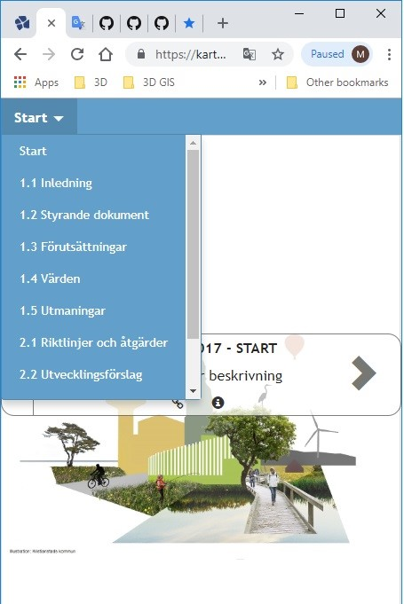

# Storymap platform

</img>

## Examples
- [Grönplan 2017 (City of Kristianstad)](https://kartor.kristianstad.se/op/?app=gp)
- [Trafikplan (City of Kristianstad)](https://kartor.kristianstad.se/op/?app=tp)

## Introduction:
Storymap platform is an easy and interactive way of presenting information in the web by using text, images and maps. For example, Kristianstads kommun is using Storymap platform for presenting masterplan, traffic plan etc. to the citizens and politicians.  

## Method: 

Storymap platform is a web application. It can read data from database or from plain Javascript file. Data handler for consuming data from database is currently available for PostgreSQL and Oracle database.

To make things simple pre-packaging has done before placing the source code in GitHub, so that post processing and other package related configuration can be skipped. However, index.js and tab.js file can be minified to index.min.js and tab.min.js file by using this https://javascript-minifier.com/ link. Index_tab.css file can be minified to index_tab.min.css file by using this https://cssminifier.com/ link. 

In order to create new application or new presentation the followings will need to be done:
For example, if we will need to create new application or new presentation called “kmp” we will need to do the below:
-	Copy the gp.css file and paste it in the same folder and change the name to kmp.css
-	Open settings.js file which will look like below:

</img>

Cope the gp object and paste it in the file for creating a new object, and change the newly created object key name from gp to kmp and afterword’s change the values as needed which will looks like below:

</img>

There are two data handler files available that are called tabs.php and items.php both for PostgreSQL och Oracle database. Change the login information depending on your system.


## Result:

Storymap platform in a large window or in desktop looks like below:

</img>

Storymap platform in a small window or in mobile looks like below:

</img>

## Administration:

For making things simple, Storymap platform is designed to read data from two tables. However, it can read data/content from a json object, which can be stored in a plain javascript file. For the simplicity, we will discuss how to register data in the database tables. 
The name of the two tables in the database are tabs and items. We will describe about those table structure below:   


### 1.	Tabs table: 

Tabs table looks like:

</img>

There are four columns available in this table and they are tabs_id, tabs, tabs_order and appname. Every distinct appname means an application or a presentation with text, images and maps. Every distinct tabs means a tab in the Storymap platform. A digital platform presentation can have as many tabs as needed. For example, appname gp have 10 tabs. Column tabs_order means order of the tabs in the Storymap platform. Tabs for gp application looks like below (red marked):

</img>

User can click into every tabs and look into the information that it contains.
Every tab can have one or more items. User can look into a list of all items for one tab like below (red marked) and can look into the content that belongs to an item. User can scroll down to the app to move from one item to another.

</img>

### 2.	Items table: 

Items are important in the Storymap platform. Each item has two parts in the application, one part is in the left side and another part is in the right side.
Left side can be represented by text or the combination of text and images. Left side of an item looks like below (red marked): 

</img>

A web map or an image can be presented in the right side. It is just only a web link that the administrator will need to add in the item table under URL column. The right side of an item looks like below (red marked):  

</img>

Digital platform reads every items from items table. Items table looks like below:

</img>

A relation is available between tabs and items table and it is tabs_id column. Every tab in Storymap platform pulls data from items table with the help of tabs_id. There are six columns available in the items table and they are items_id, items, url, items_order, content, tabs_id. Description of each of those columns are written below:


| Column name |  Description |
| ------------- | ------------- |
|items_id	       |Id number for each item in the item table.|
|items	           |Item name/title for each item. Item name list/title list shows in Storymap platform when a user clicks in the title list button (red marked in image 3)|
|url	           |It is a web link for showing its content on the right side of the Storymap platform. Content of this link can be an image or a web map.|
|items_order	   |Items_order defines in which order items are placed in the digital platform under a tab. |
|content	       |This is a plain html tags that an administrator will need to write and they will be shown at the left side of the digital platform. Administrator can add text, image etc. there. Administrator can design as his wish with lots of different html tags or can just follow some example content that we will write later or can follow the content from Kristianstad Kommun Storymap platform as an example.|
|tabs_id	       |This id is a relation number between tabs and items table. This id number defines which item belongs to under which tab.|

#### Content: 
Now we will write more about content and will describe different example to write content.
#### Exempel 1:  
One item content in the digital platform looks like below (red marked).

</img>

To show like above, we will need to write the html tags in the content column like below:
```
"<h style='font-family:verdana;font-size:24px;'>START</h>
<ul>
<li primaryKey ='pri_17'  foreignKey='pri_8' style='color:#5389ae;'><ins>Projektorganisation</ins></li>
<li style='color:#5389ae;' primaryKey ='pri_17' foreignKey='pri_45'><ins>Läshänvisning</ins></li>
<li style='color:#5389ae;' primaryKey ='pri_17' foreignKey='pri_9'><ins>Sammanfattning</ins></li>
</ul></br>
</br>
<h23>Foto: Kristianstads kommun</h23></br>
<h primaryKey ='pri_100' foreignKey='pri_8' style='font-family:verdana;font-size:13px;color:#5389ae;'><ins>Nästa avsnitt >></ins></h></br>" 
```
Administrator can use the same html tags in different content with little adjustment by changing the text, images etc. It is possible to add primaryKey and foreignKey as attribute for moving/linking from one item to another. In that example, we have used unordered html list (`ul`) tag, list (`li`) html tag, header (`<h>, <h23>`) tag, image (``) html tag, break line (`</br>`) html tag etc. 

#### Example 2: 
Another content in the digital platform looks like below (red marked):

</img>

 To show like above, we will need to write the html tags in the content column like below:
```
 "<h primaryKey ='pri_14' foreignKey='pri_20' style='font-family:verdana;font-size:13px;color:#5389ae;'><ins><< Tillbaka till Förutsättningar</ins></h></br>
<h style='font-family:verdana;font-size:25px;'>Landskapets karaktär</h>
<p style='font-family:verdana;font-size:14px;'>Kristianstads kommun har tre huvudsakliga landskapstyper, hav, slätt-landskap och skogslandskap. Dessa kan i sin tur delas in i åtta landskaps-typer. Kustlandskapet, i övergången mellan hav och slätt, har dessutom två olika karaktärer, i söder en sandstrand med tallskogsklädda sanddyner och i norr ett flackt skärgårdslandskap. På slätten framträder Helgeåns våtmarker som en egen karaktär. Linderödsåsen och Nävlingeåsen skiljer sig en del mot Sjö- och sprickdalslandskapet i norr som kan beskrivas som en egen landskapstyp. I övergångszonen mellan slätten och skogslandskapet finns mosaikmarker som varken kan placeras i slättlandskapet eller skogslandskapet och därför får en egen karaktär. De åtta landskapstyperna kan i sin tur delas in ett antal karaktärsområden med olika utseende och innehåll.</br></br>
</br>
<p style='font-family:verdana;font-size:13px;'><em>Illustration: Juho Riikonen</em>
</br></br>
<h primaryKey ='pri_404' foreignKey='pri_15' style='font-family:verdana;font-size:13px;color:#5389ae;'><ins>Nästa avsnitt >></ins></h></br></p>"
```
Administrator can use the same html tags in different content with little adjustment by changing the text, images etc. It is possible to add primaryKey and foreignKey as attribute for moving/linking from one item to another. In the above example, we have used header (`<h>, <h23>`), image (``), break line (`</br>`), paragraph (`<p>`) and other html tags. The easiest way to make more familiar with content writting for Storymap platform is to look into the examples pages (Grönplan and Trafikplan för Kristianstds kommun).  


## Conclusion:

Storymap platform is dynamic and robust and one can create as many web presentations as needed. Storymap platform is flexible to develop for increasing its functionalities.  
